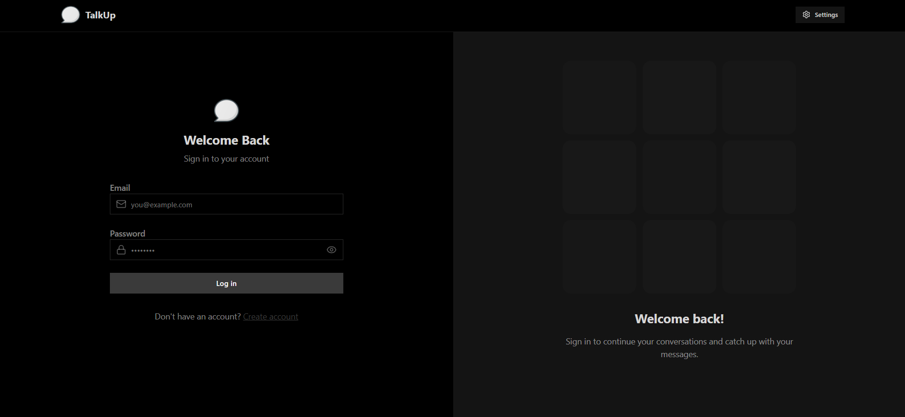
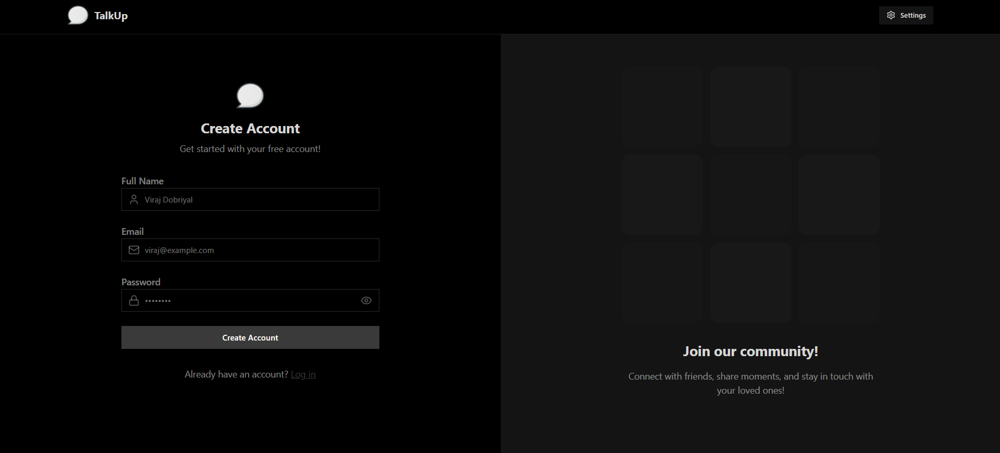
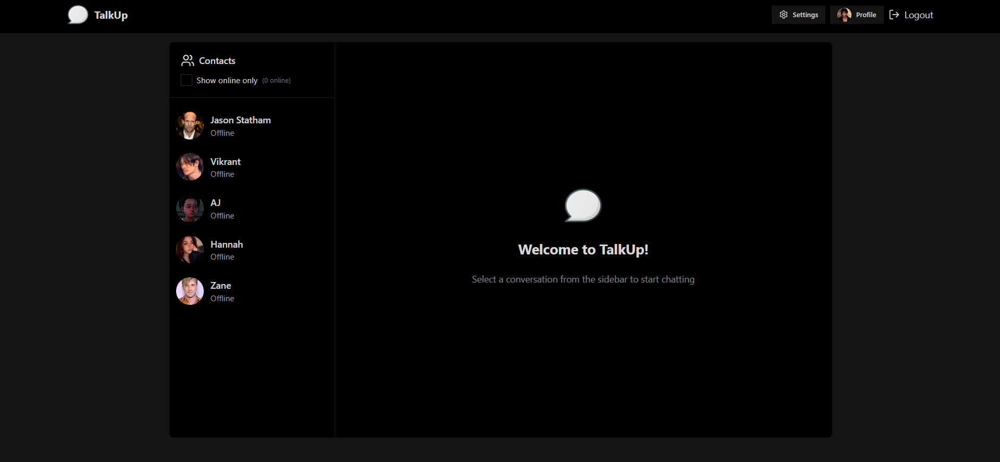
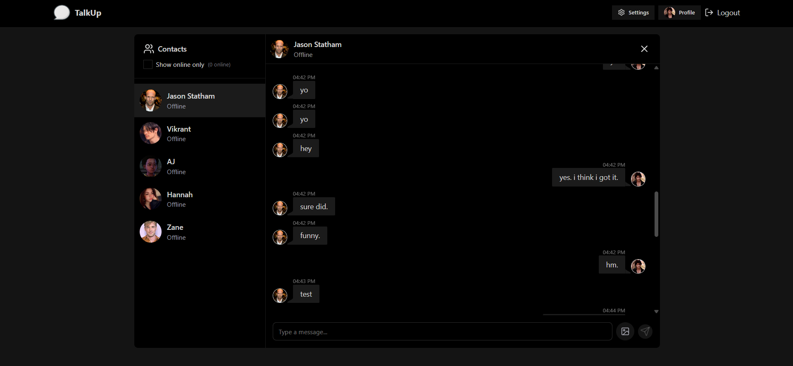
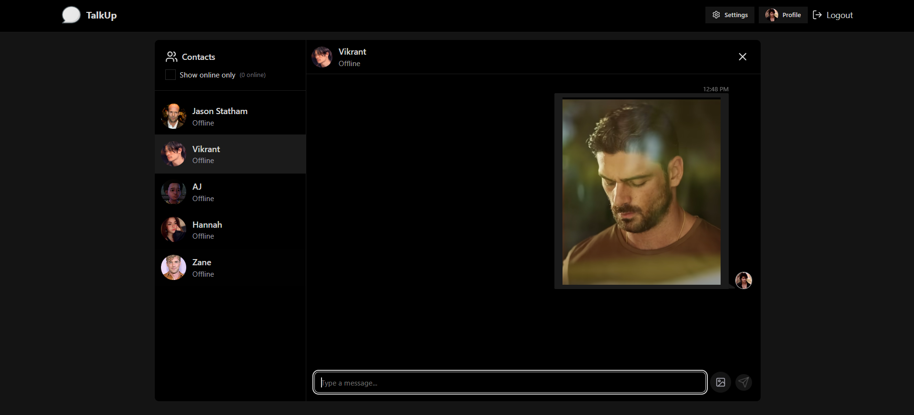
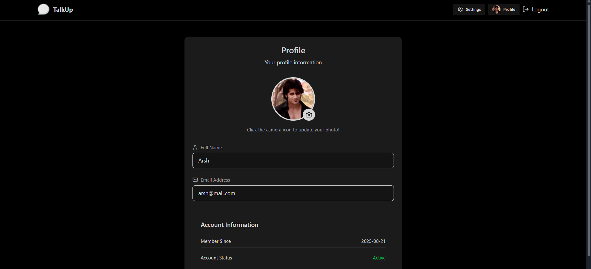
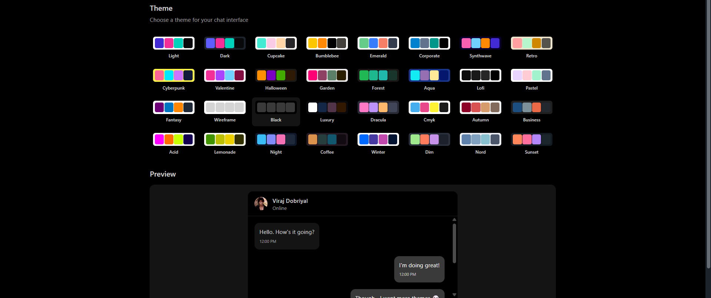
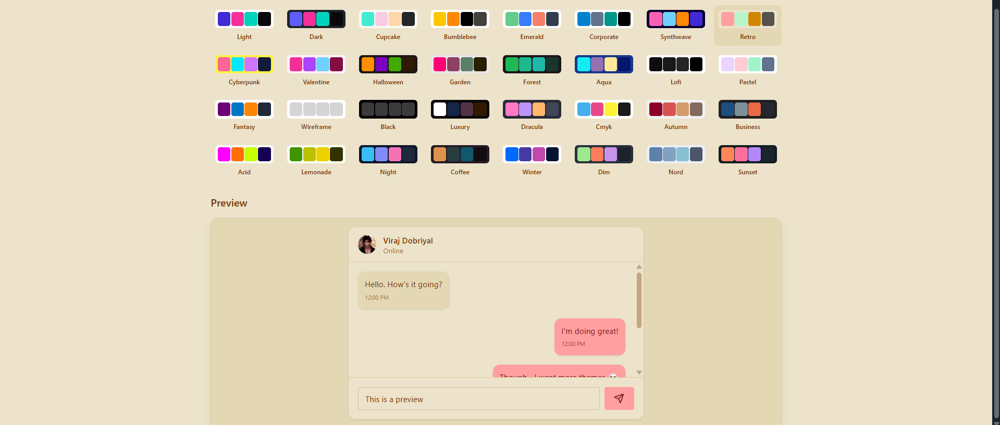

# TalkUp

TalkUp is a full-stack real-time chatting app that makes connecting with friends simple and fast. Users can sign up, send messages instantly, and manage conversations from a sleek, distraction-free UI.

---

## Features

- 💬 Real-time one-to-one
- 🔐 Secure authentication with JWT
- 📩 Instant message delivery powered by WebSockets
- 📷 Share images & media in chats
- 🧾 View and manage all your conversations in one place

---

## Tech Stack

- MongoDB + Mongoose  
- Express.js  
- React (Vite)  
- Node.js  
- WebSockets (Socket.IO)  
- Cloudinary (for media uploads)  
- JWT Authentication (with encrypted password saving in the database)
  
---

## 📸 Screenshots  

<p align="center">
  
  
</p>

<p align="center">
  
  
</p>

<p align="center">
  
  
</p>

<p align="center">
  
  
</p>

---

## Live Preview

[Render.com](https://talkup-zo5e.onrender.com)

---

## 🛠️ Running Locally

1. **Clone the repository**
   ```bash
   git clone https://github.com/derarshan/talkup.git
   cd talkup
   ```

2. Install dependencies
```bash
npm install --prefix backend
npm install --prefix frontend
```
3. Set up environment variables
- Create a .env file inside the backend folder with:
  - MONGO_URI=your_mongodb_connection_string
  - JWT_SECRET=your_secret_key
  - CLOUDINARY_CLOUD_NAME=your_cloud_name
  - CLOUDINARY_API_KEY=your_api_key
  - CLOUDINARY_API_SECRET=your_api_secret
 
4. Start the app
```bash
# Start backend
npm run start --prefix backend

# Start frontend (in another terminal)
npm run dev --prefix frontend
```

---

## Why this project?

This app was built to practice full stack development with the MERN stack and real time communication. It helped me understand WebSocket integration, authentication, media handling with Cloudinary, and designing a smooth, user friendly chat interface, all while building something people can actually use to connect instantly.

---

Made with purpose by [@derarshan](https://github.com/derarshan) 

